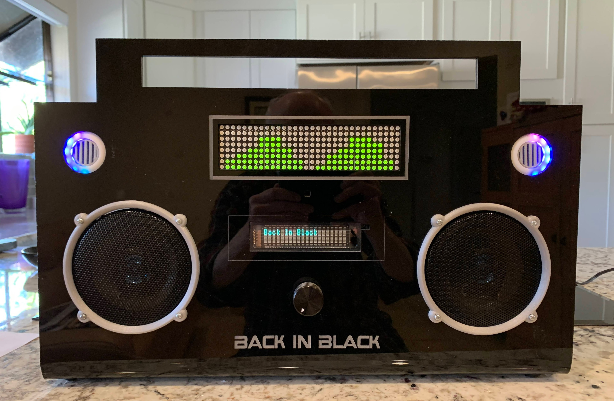

# **BoomboxRedux**

## *Description:*
A 0.25in black acrylic case, laser cut and etched to hold electronics for a boombox.
Updated from a 2014 build.

See the posting at:
TBA:
https://www.hackster.io/thisoldgeek/kinetic-courier

## *Required Hardware:*
* Enclosure/Frame - 18in x 24in sheet of 1/4in black cast acrylic, $45 at Tap Plastics
* raspberry pi 3+
* Adafruit UBEC - Universal Battery Elimination Circuit to step 12V down to 5V, $9.95
* Adafruit mini-remote
* 12V Power Supply
* Adafruit Vacuum Fluorescent  Display 20 Char x 2 Lines, part ID 347 , $29.95 (Since Discontinued!)
* Adafruit panel mount 2.1 mm DC barrel jack, part ID 610  $2.95
* Syba (C-Media) USB sound adapter, available at amazon.com $7.99
* IR Sensor, TSOP38238, available at adafruit, product ID 157 , $1.95; also Mouser and others
* Lighted push button switch, about $4.00
* Adafruit 16x32 RGB LED matrix, $24.95 
* Adafruit 20W Class D amp, $19.95
* Adafruit 20W 4 Ohm Speaker (two needed), $14.95
* Adafruit Neopixel 12 Ring (two needed) for the "VU Meters", $7.50 each
* Sparkfun Spectrum Shield, $24.95
* Arduino Stackable Headers from Sparkfun for the Spectrum Shield, $1.50
* Additional 3.5mm male to male headphone extension (Spectrum Shield to amp)
* Arduino Uno (substitute can be Leonardo/Clone), $24.95
* Sugru, Hot Glue, E6000, double-sided tape to fasten things

## *Fabrication:*
* Coreldraw Files in BoomboxRedux/docs folder
* Assemble components, test, and insert into case

## *Configuration:*
 Install required libraries, python programs and run scripts. 
 Load Arduino with *.ino sketch from Boombox Redux base folder.

 The raspberry pi software installation is rather long, about 4 hours.
 See tutorial at hackster.io/thisoldgeek

## * Defaults on Startup *
* Startup routine runs: VFD display if mpc "play" activated

## *REQUIRED:*
* DarkSky API Key for weather information

## *More Information:*
TBA
See the build log at hackster.io/thisoldgeek Boombox Redux

## *Update March 05, 2020:*
Initial install.

